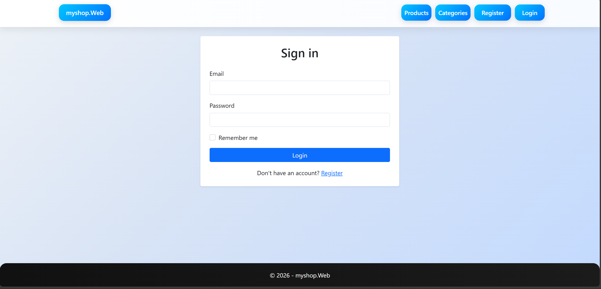
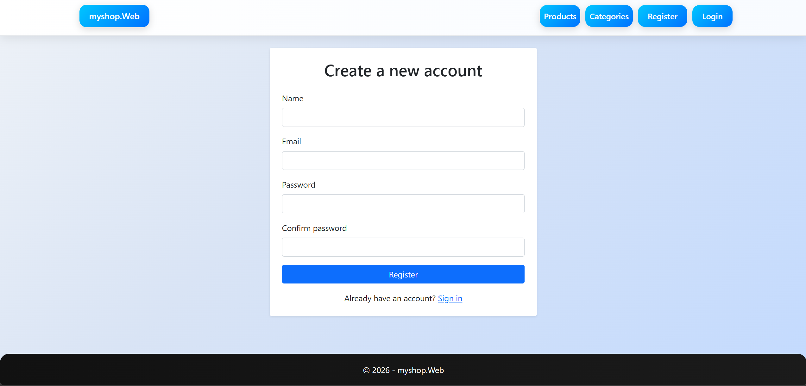
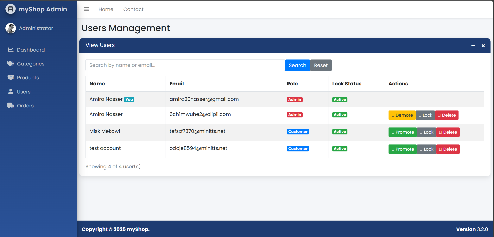
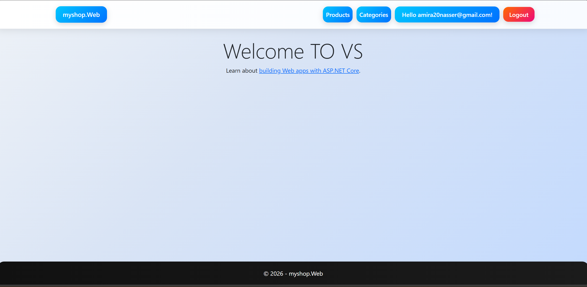
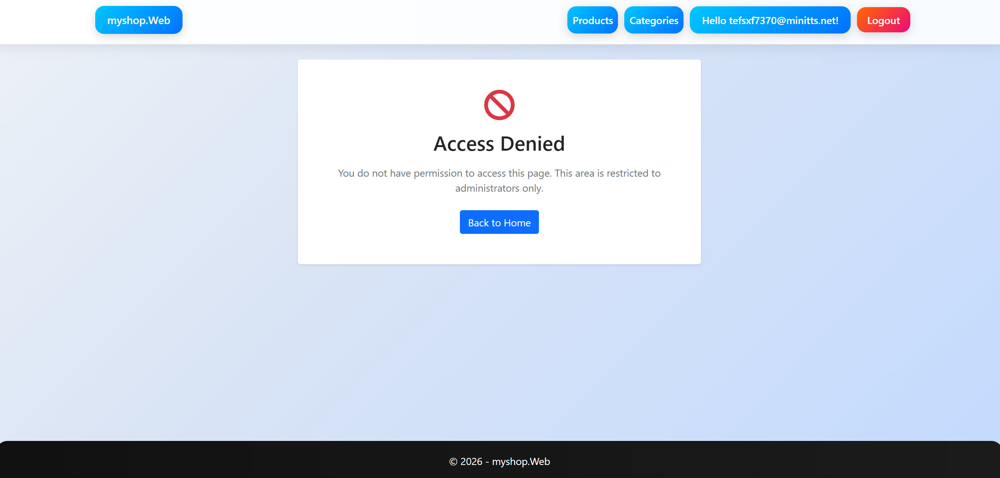
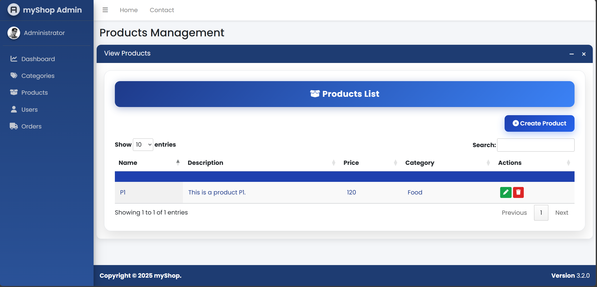

# ShopHub Startup Template

A clean ASP.NET Core MVC startup template designed for students to build E-Commerce projects using the Repository Pattern and Entity Framework Core.

## Screenshots

| | |
|---|---|
|  |  |
|  |  |
|  |  |

## Features

- ASP.NET Core MVC
- Entity Framework Core
- Repository Pattern
- SQL Server Integration
- Identity Authentication
- Bootstrap UI
- AdminLTE Dashboard
- DataTables Integration
- Toastr Notifications
- SweetAlert2
- TinyMCE Support (Optional)
- File Upload Support
- Session Configuration

## Test Account (Demo)

Use these credentials to log in and test the application:

```
Email:    6ch1mwuhe2@olipii.com
Password: 1234@Abc
```

## Included Modules

### Category
- Create Category
- View Categories
- Edit Category
- Delete Category

### Product
- Create Product
- Upload Product Image
- View Products
- Edit Product
- Delete Product

## Project Structure

```
Controllers/
DataAccess/
Entities/
    Models/
    ViewModels/
Repositories/
Views/
wwwroot/
```

## Technologies

- ASP.NET Core MVC
- Entity Framework Core
- SQL Server
- LINQ
- Bootstrap 5
- AdminLTE 3
- jQuery
- DataTables

## Database

Update the connection string inside:

```
appsettings.json
```

Then run:

```bash
Update-Database
```

or

```bash
dotnet ef database update
```

## Default Features

- Repository Pattern
- Dependency Injection
- CRUD Operations
- File Upload
- Entity Relationships
- ViewModels
- TempData Notifications

## Notes

This template is intended as a starting point for educational E-Commerce projects. Students are expected to extend it with additional features such as:

- Shopping Cart
- Orders
- Payments
- Reviews
- Wishlist
- Authentication Enhancements
- Dashboard Analytics

## SMTP Configuration (User Secrets)

Sensitive SMTP credentials are **not** stored in the repository. They are kept in
the .NET User Secrets store (outside the repo) or in environment variables.

To configure locally, open a terminal in `myshop.Web/` and run:

```bash
dotnet user-secrets set "Email:Smtp:Username" "your-email@gmail.com"
dotnet user-secrets set "Email:Smtp:Password" "your-app-password"
```

Non-sensitive settings (Host, Port, FromEmail, FromName) stay in `appsettings.json`.
For production, set the same keys as environment variables instead:

```
Email__Smtp__Username=your-email@gmail.com
Email__Smtp__Password=your-app-password
```

## Database Backup (.bak)

A full backup of the `myshop` database is available at:

```
DatabaseBackups/myshop.bak
```

To re-create it from SQL Server Management Studio (SSMS) or `sqlcmd`:

```sql
BACKUP DATABASE [myshop]
TO DISK = N'C:\Backup\myshop.bak'
WITH INIT, NAME = N'myshop-Full Database Backup';
```

To restore:

```sql
RESTORE DATABASE [myshop]
FROM DISK = N'C:\Backup\myshop.bak'
WITH REPLACE;
```

## License

Educational Use Only.
